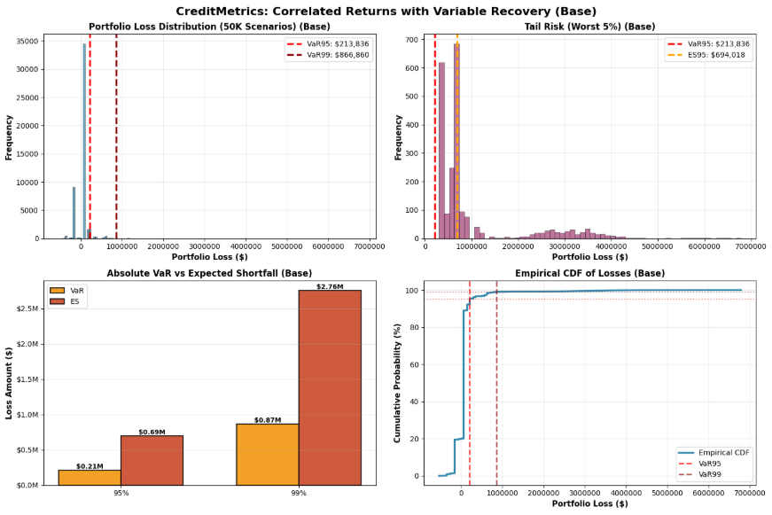
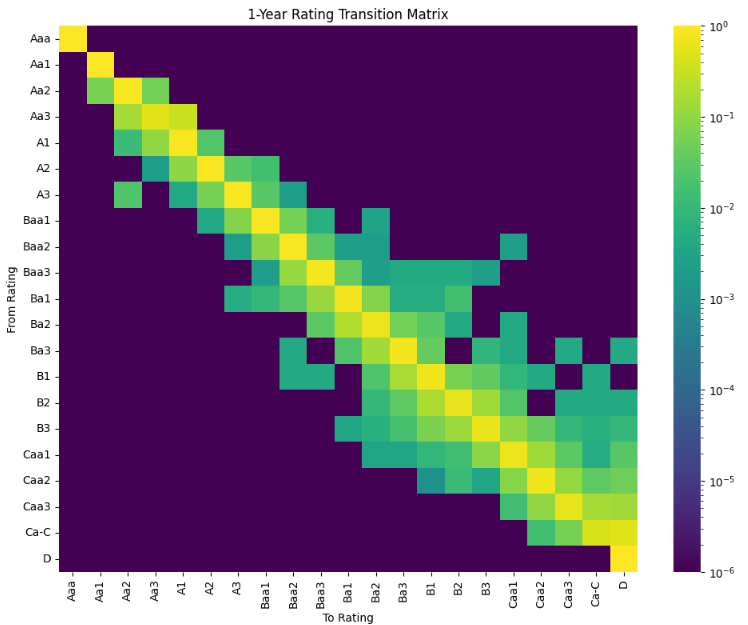

# CreditMetrics Portfolio Risk Model

A Python implementation of the CreditMetrics framework for estimating
portfolio credit risk using Monte Carlo simulation.

## Features

- Credit rating migration
- Monte Carlo simulation
- Expected Loss (EL)
- Unexpected Loss (UL)
- Credit VaR
- Expected Shortfall
- Portfolio loss distribution
- Risk visualisation

## Mathematical Framework

The model follows the CreditMetrics methodology by:

1. Generate uncorrelated asset returns (50,000 scenarios)
2. Apply Cholesky matrix to induce correlations
3. Map correlated returns to rating scenarios using thresholds
4. Generate uncorrelated recovery rates using Beta distribution
5. Calculate implied loan forward values (default or non-default)
6. Aggregate to portfolio values
7. Calculate Absolute VaR and Expected Shortfall
8. Testing is done for simulation stability, and that all rows in transition matrix equal to 1

## Portfolio Construction

| Name | Ticker | Rating | Principle | Maturity | Coupon |
|---|---|---|---|---|---|
| Boyd Gaming Corp | BYD | Baa3| $4,000,000 | 3 Years | 6% |
| Brinker International Inc | EAT | Baa3| $5,000,000 | 4 Years | 7% |
| American Airlines Group Inc | BYD | B1| $6,000,000 | 5 Years | 8% |

## Repository Structure

```
CreditMetrics-Python/
│
├── README.md                  # Project homepage
├── requirements.txt
├── .gitignore
│
├── data/
│   ├── correlation.csv
│   ├── thresholds.csv
│   ├── transition_matrix.csv
│   ├── valuation.csv
│   └── README.md
│
├── notebook/
│   └── creditmetrics_demo.ipynb
│
├── src/
│   ├── __init__.py
│   ├── config.py
│   ├── portfolio.py
│   ├── risk_metrics.py
│   ├── simulation.py
│   └── visualisation.py
│
├── tests/
│   ├── __init__.py
│   ├── test_creditmetrics.py
│   └── test_transition.py
│
├── figures/
│   ├── loss_distribution.png
│   ├── migration_matrix.png
│   ├── convergence.png
│   └── portfolio_summary.png
│
└── docs/
    ├── methodology.pdf
    └── assumptions.md
```


## How to run

1. Clone the repo and create a virtual environment:
   ```bash
   git clone https://github.com/kobbyga/creditmetrics-python.git
   cd creditmetrics-python
   python -m venv venv
   source venv/bin/activate  # Windows: venv\Scripts\activate
   pip install -r requirements.txt
   ```

3. Launch Jupyter Notebook
- Open creditmetrics_demo.ipynb
- Run all cells

## Results

| Confidence Interval | Absolute VaR ($) | Absolute ES ($) | 
|---|---|---|
| 95% | 213,836.00 | 694,018.19 |
| 99% | 866,860.00 | 2,755,088.59 | 

## Figures

- Portfolio loss distribution 
  

- Heatmap showing ratings migration across 1 year
  
## Future Improvements

...
